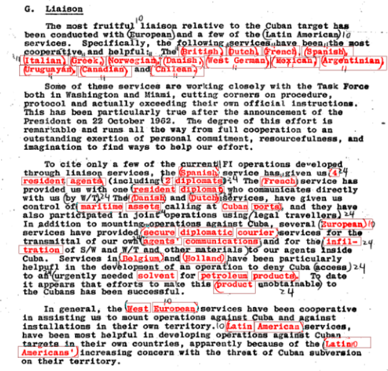

# `diff` `-jfk`

As of March 20th, there is a total of 2,343 documents released by the U.S.
National Archives and Records Administration (NARA) in [JFK Assassination
Records - 2025 Documents
Release](https://www.archives.gov/research/jfk/release-2025).

The total page count that NARA indicates that there were a total of 77,100
pages released, though in downloading all 2,343 files and summing their page
numbers, I get a higher total of 82,864 pages.

Wouldn't it be nice if someone went through to highlight the newly un-redacted
parts of previous reports? Well, dear reader, I got you!

But first let me help you get oriented. 

## `*_fresh` vs `*_highlighted`

There are two flavors of PDFs that I've generated - `_fresh` and `_highlighted`.
The `_fresh` versions
contain *only* the pages where there is something different, and each page has
some text at the top indicate what the corresponding page number was in the original
released document. There's also a `_highlighted` version, which contains whole
document, with the highlighting of differences in their entire context. The
notes at the top of the highlighted document (and top of each fresh page) are
in light blue so as not to be too intrusive, and you can highlight them to read
or copy when you end up seeking out the original, because in cases where the
`diff-jfk` version is not legible.

Now you have the necessary information, if you're ready to dive in, just click below:
##  [ >> Happy Sleuthing << ](2025)

 

Otherwise, stick around for some more information and examples.

## Unredacted diffs

Turns out that [Mary Ferrell Foundation](https://www.maryferrell.org/) is an excellent resource, see [their 2025 JFK Records Releases](https://www.maryferrell.org/pages/Featured_2025_JFK_Records_Releases.html). Unlike the MFF, which is choosing to redact the social security numbers, `diff-jfk` is not. 

The only visual differences in the `diff-jfk` generated documents that are omitted from counting toward _fresh_ pages are the very top of the first page document. This is where there would be an expected difference in the banner indicating the year of the release. And also the bottom of each page that was used to keep track of document ID and page number but ended up reproducing slightly different in some of the documents, so I discarded that to get fewer false-positives.

These trivial changes are not informative, so they has been explicitly omitted from "_fresh_" consideration. So a document that was initially released in 2023, and again released in 2025, would have a red mark in the last digit of the year in the banner on top of its first page, but such a page would not be considered "_fresh_" if there are no other changes on that first page. You will still see that red mark, however, if there were other changes to the page.

## Some samples

Here are some examples of the new information that's been released:

[2025/104-10301-10001_fresh.pdf](2025/104-10301-10001_fresh.pdf) - fresh page 1 has previously censored details of CIA's 1961 budget: $41.5 million spent on Cuban operations, $11 million on the rest of Latin America

[2025/124-10114-10010_highlighted.pdf](2025/124-10114-10010_highlighted.pdf) shows you the one previously redacted box, which now reveals the word "Embassy" in between "Paris" and "CAS". CAS is one of the terms of art that I learned in preparing these documents - it stands for Controlled American Source - CIA. 

When it works, it works brilliantly. [2025/177-10002-10105_fresh.pdf](2025/177-10002-10105_fresh.pdf) has just the two pages that have newly declassified information which concerns understanding of Soviet submarine fleet in 1966-68, but if you wish you can [peruse the entire 14 page document](2025/177-10002-10105_highlighted.pdf) which now highlights the declassification.

Take for example, [2025/104-10307-10006_highlighted.pdf](2025/104-10307-10006_highlighted.pdf), where you can learn, among other things about how CIA set up a special facility in Miami to **intercept electronically internal communications** within Cuba, 

details of the 14 countries' spy agencies which "have been most cooperative and helpful" (page 12),

where one of the sources was a former protege of **Raul CASTRO** , one was and ambassador of a **North African** country in Cuba, and another was a Cuban ambassador in Western Europe (page 5).

Document 104-10178-10000 contains, among other things, the tales of WKSCARLET-3,
with some juicy bits about plans for that Venezuelan to bug the Colombian
delegation in Rome during Colombian-Venezuelan border talks in 1973.

The full-context [highlighted document](2025/104-10178-10000_highlighted.pdf) has 310 pages, whereas the [freshly declassified pages](2025/104-10178-10000_fresh.pdf) add up to 86. The image above is page 72 in the original document, and appears on page 9 of the fresh-only version.

## Limitations of Minimal Magic

I didn't do anything fancy to try to get the pages to line up properly. Also,
the approach I took with highlighting works pretty well for pages that were
previously redacted in white, but isn't as legible for documents which were
previously blacked out. So take this with a grain of salt. Hopefully it helps
you identify *where* to look in the original document if you can't make it out
in the `diff-jfk` version.

Slight rotations, rescans, change to the cropping, and so on, make the
previously unredacted parts of the document either hard to read or completely
illegible. Nevertheless, despite this limitation, it's still makes it easier to
scan the highlighted document to identify which pages to look at in the newly
unredacted document. For example, scanning through the otherwise atrocious mess
in the `diff-jfk` version of
[2025/124-10179-10220_highlighted.pdf](./2025/124-10179-10220_highlighted.pdf),
I was quickly able to come to page 37 that previously had censorship boxes, and
looking on the same page of the
[original](https://www.archives.gov/files/research/jfk/releases/2025/0318/124-10179-10220.pdf),
I can see that the August 20, 1968 (Warsaw Pact invasion of Czechoslovakia)
example of positive intelligence involved the wiretapping of, previously
redacted, "the Soviet Mission to the United Nations". On the next page,  phrase
"the Romanian Embassy" was omitted from a description of another wiretap, and
further down the page the previously censored phrase of "intercepts on various
missions to the United Nations and embassies" providing many indicators during
Arab-Israeli Six Day War and the India-Pakistan War.

There's more to be done, but I wanted to get this out there and not let
perfect be the enemy of good enough. Here's an example of what's supposed to be
the same document but having different page numbers. On the left hand side is
Page 57 of 2023/docid-32404520.pdf and on the right is page 61 of
2025/104-10332-10007.pdf 

By the way, that's definitely one of the recurring themes for what I've come
across being previously censored but now reveled in these documents: the use of
State department cover. It also came up in, to name just a few:
20225/104-10330-10102.pdf and 2025/104-10330-10083.pdf

## How `diff-jfk` came to be

The first thing we can do is just hope for the best and assume that the filename hasn't changed and exactly matches the previous release (2023).

That gets us 849 files, 36.24% of the total file count with exact matches that were previously released in 2023. Not bad for a first pass, and this haul actually gets us the bulk of the raw-page count, because these 849 files contain 44770 pages, so we're already more than half way there!

To continue on, it's a bit of a slog, because whereas in 2025 all files started off with the 3-5-5 pattern, that's not the case for earlier years. We luckily have a [spreadsheet from 2023](https://www.archives.gov/files/research/jfk/national-archives-jfk-assassination-records-2023-release.xlsx) which gives us a mapping for record number to filename. There are also such spreadsheets for [2022](https://www.archives.gov/files/research/jfk/national-archives-jfk-assassination-records-2022-release.xlsx), [2021](https://www.archives.gov/files/research/jfk/national-archives-jfk-assassination-records-2021-release.xlsx), and the [2017-2018 releases](https://www.archives.gov/files/research/jfk/national-archives-jfk-assassination-records-2017-2018-release.xlsx).

### Duplicate ambiguity

Ok, we also have the problem of ambiguity where from the filename, we have
multiple files for the same record number. For example, we have
`./2025/104-10105-10290 (C06932214).pdf` and also `./2025/104-10105-10290.pdf`,
there's also `2025/124-10273-10007_multirif.pdf` and `2025/124-10273-10007.pdf`
and so on.

Anyway, I'll spare you the rest of the details, except to say that I got pretty
close to finding previous versions of all of the files. 

    2023:       matching files: 873,    left: 1456
    2022:       matching files: 1349,   left: 107
    2021:       matching files: 0,      left: 107
    2017_2018:  matching files: 13,     left: 94

There are 2,221 files from the 2025 release that I've managed to match to a
previous version with the same page count. 

Another 26 files where the previous and 2025 release have a different number of
pages. A handful of those just lost or gained a page or two, I was able to
accommodate and fix, but there's more work to be done to completely close those
out.

 Table of 26 files where previous version does not have same page number (click here toggle visibility)

| File Name |  Num Pages | Previous File Name | Previous Num Pages | Page Difference | Notes |
| --------- |  --------- | ------------------ | ------------------ | --------------- | ----- |
| `2025/104-10302-10028.pdf` |  133 | 2023/docid-32401336.pdf | 140 | -7 | The President’s Intelligence Checklist. 2025 shorter by 7 pages, it starts at 21 Nov 1963, whereas in 2023 there was also 20 Nov 1963 – page scrabmled issues |
| `2025/104-10330-10044.pdf` |  5 | 2023/docid-32404031.pdf | 6 | -1 | Page 1 from 2023 omitted in 2025, scanned in a slightly rotated orientation |
| `2025/104-10330-10083.pdf` |  13 | 2023/docid-32404069.pdf | 14 | -1 | Page 1 from 2023 omitted in 2025, scanned in a slightly rotated orientation |
| `2025/104-10332-10007.pdf` |  81 | 2023/docid-32404520.pdf | 77 | 4 | 4 pages inserted somewhere, order of pages different after page 35 |
| `2025/104-10332-10008.pdf` |  22 | 2023/docid-32404521.pdf | 23 | -1 | Page 1 from 2023 omitted in 2025, scanned in a slightly rotated orientation |
| `2025/104-10332-10009.pdf` |  76 | 2023/docid-32404522.pdf | 77 | -1 | None |
| `2025/104-10332-10021.pdf` |  22 | 2023/docid-32404534.pdf | 23 | -1 | Page 1 from 2023 omitted in 2025 and order of pages is different |
| `2025/124-10179-10217.pdf` |  2 | 2022/docid-32989640.pdf | 370 | -368 | None |
| `2025/124-10179-10219_multirif.pdf` |  370 | 2023/124-10179-10219.pdf | 2 | 368 | None |
| `2025/124-10179-10221_multirif.pdf` |  370 | 2022/docid-32989574.pdf | 640 | -270 | should actually be 2022/docid-32989640.pdf |
| `2025/124-10185-10099 (c06716626).pdf` |  8 | 2023/docid-32989624.pdf | 288 | -280 | None |
| `2025/124-10185-10099.pdf` |  170 | 2023/docid-32989624.pdf | 288 | -118 | 2025/124-10186-10041.pdf is 118 pages long, does it fit here?, also with 8 pages from c0671 below, there’s 2025/104-10210-10037.pdf that’s 110 pages long, as is 2025/104-10164-10110.pdf |
| `2025/124-10185-10214.pdf` |  11 | 2022/docid-32989599.pdf | 126 | -115 | None |
| `2025/124-10204-10101.pdf` |  10 | 2018/docid-32989602.pdf | 147 | -137 | None |
| `2025/124-10206-10180.pdf` |  40 | 2022/docid-32290904.pdf | 12 | 28 | None |
| `2025/124-10222-10171.pdf` |  3 | 2022/docid-32298395.pdf | 2 | 1 | Page 3 new in 2025 |
| `2025/124-10226-10305.pdf` |  165 | 2022/docid-32300025.pdf | 35 | 130 | None |
| `2025/124-10271-10299.pdf` |  14 | 2023/docid-32989588.pdf | 270 | -256 | None |
| `2025/124-10271-10301.pdf` |  1 | 2022/docid-32989609.pdf | 223 | -222 | None |
| `2025/124-10273-10086_multirif.pdf` |  440 | 2018/docid-32989602.pdf | 147 | 293 | None |
| `2025/124-10273-10289_redacted.pdf` |  3057 | 2023/docid-32989646.pdf | 1417 | 1640 | None |
| `2025/124-10274-10029.pdf` |  3 | 2022/docid-32989627.pdf | 304 | -301 | None |
| `2025/124-90073-10039.pdf` |  28 | 2022/docid-32328335.pdf | 3 | 25 | None |
| `2025/157-10014-10005.pdf` |  112 | 2023/docid-32423393.pdf | 113 | -1 | Page 61 from 2023 omitted in 2025 (as evidenced by page count at the bottom that goes 60 to 62. |
| `2025/177-10002-10092.pdf` |  7 | 2023/177-10002-10092.pdf | 6 | 1 | Page 2 new in 2025 |
| `2025/180-10147-10176.pdf` |  24 | 2023/180-10147-10176.pdf | 25 | -1 | Page 1 from 2023 omitted in 2025, scanned in a slightly rotated orientation, size mismatch |

It's not perfect, but it's a pretty damn good start.

## Previously unreleased files

Finally, here's a list of files that I believe are entirely new in the 2025
releases. As there is nothing to diff against, I did not generate fresh or
highlight files for them. 

 Table of 94 files and their page counts, that were first released in 2025. (click here toggle visibility)

| File Name |  Num Pages |
| --------- |  --------- |
| [`2025/124-10203-10246.pdf`](2025/124-10203-10246.pdf) |  6 |
| [`2025/124-10203-10276.pdf`](2025/124-10203-10276.pdf) |  19 |
| [`2025/124-10203-10292.pdf`](2025/124-10203-10292.pdf) |  3 |
| [`2025/124-10203-10294.pdf`](2025/124-10203-10294.pdf) |  21 |
| [`2025/124-10203-10464.pdf`](2025/124-10203-10464.pdf) |  6 |
| [`2025/124-10203-10465.pdf`](2025/124-10203-10465.pdf) |  2 |
| [`2025/124-10203-10466.pdf`](2025/124-10203-10466.pdf) |  3 |
| [`2025/124-10203-10468.pdf`](2025/124-10203-10468.pdf) |  2 |
| [`2025/124-10203-10482.pdf`](2025/124-10203-10482.pdf) |  3 |
| [`2025/124-10203-10485.pdf`](2025/124-10203-10485.pdf) |  2 |
| [`2025/124-10203-10489.pdf`](2025/124-10203-10489.pdf) |  4 |
| [`2025/124-10203-10494.pdf`](2025/124-10203-10494.pdf) |  2 |
| [`2025/124-10203-10497.pdf`](2025/124-10203-10497.pdf) |  2 |
| [`2025/124-10204-10004.pdf`](2025/124-10204-10004.pdf) |  4 |
| [`2025/124-10204-10146.pdf`](2025/124-10204-10146.pdf) |  2 |
| [`2025/124-10204-10147.pdf`](2025/124-10204-10147.pdf) |  3 |
| [`2025/124-10204-10154.pdf`](2025/124-10204-10154.pdf) |  2 |
| [`2025/124-10204-10157.pdf`](2025/124-10204-10157.pdf) |  3 |
| [`2025/124-10204-10203.pdf`](2025/124-10204-10203.pdf) |  4 |
| [`2025/124-10204-10204.pdf`](2025/124-10204-10204.pdf) |  4 |
| [`2025/124-10204-10206.pdf`](2025/124-10204-10206.pdf) |  3 |
| [`2025/124-10204-10209.pdf`](2025/124-10204-10209.pdf) |  2 |
| [`2025/124-10204-10211.pdf`](2025/124-10204-10211.pdf) |  4 |
| [`2025/124-10204-10212.pdf`](2025/124-10204-10212.pdf) |  2 |
| [`2025/124-10204-10213.pdf`](2025/124-10204-10213.pdf) |  3 |
| [`2025/124-10204-10215.pdf`](2025/124-10204-10215.pdf) |  2 |
| [`2025/124-10204-10278.pdf`](2025/124-10204-10278.pdf) |  3 |
| [`2025/124-10204-10297.pdf`](2025/124-10204-10297.pdf) |  4 |
| [`2025/124-10204-10322.pdf`](2025/124-10204-10322.pdf) |  4 |
| [`2025/124-10204-10495.pdf`](2025/124-10204-10495.pdf) |  46 |
| [`2025/124-10223-10008.pdf`](2025/124-10223-10008.pdf) |  3 |
| [`2025/124-10223-10015.pdf`](2025/124-10223-10015.pdf) |  2 |
| [`2025/124-10223-10017.pdf`](2025/124-10223-10017.pdf) |  3 |
| [`2025/124-10223-10042.pdf`](2025/124-10223-10042.pdf) |  2 |
| [`2025/124-10223-10064.pdf`](2025/124-10223-10064.pdf) |  3 |
| [`2025/124-10223-10067.pdf`](2025/124-10223-10067.pdf) |  2 |
| [`2025/124-10223-10068.pdf`](2025/124-10223-10068.pdf) |  3 |
| [`2025/124-10223-10070.pdf`](2025/124-10223-10070.pdf) |  3 |
| [`2025/124-10223-10071.pdf`](2025/124-10223-10071.pdf) |  2 |
| [`2025/124-10223-10073.pdf`](2025/124-10223-10073.pdf) |  3 |
| [`2025/124-10223-10074.pdf`](2025/124-10223-10074.pdf) |  2 |
| [`2025/124-10223-10076.pdf`](2025/124-10223-10076.pdf) |  2 |
| [`2025/124-10223-10077.pdf`](2025/124-10223-10077.pdf) |  2 |
| [`2025/124-10223-10079.pdf`](2025/124-10223-10079.pdf) |  3 |
| [`2025/124-10223-10082.pdf`](2025/124-10223-10082.pdf) |  3 |
| [`2025/124-10223-10083.pdf`](2025/124-10223-10083.pdf) |  2 |
| [`2025/124-10223-10085.pdf`](2025/124-10223-10085.pdf) |  2 |
| [`2025/124-10223-10086.pdf`](2025/124-10223-10086.pdf) |  2 |
| [`2025/124-10223-10087.pdf`](2025/124-10223-10087.pdf) |  2 |
| [`2025/124-10223-10088.pdf`](2025/124-10223-10088.pdf) |  3 |
| [`2025/124-10223-10101.pdf`](2025/124-10223-10101.pdf) |  3 |
| [`2025/124-10223-10121.pdf`](2025/124-10223-10121.pdf) |  2 |
| [`2025/124-10223-10159.pdf`](2025/124-10223-10159.pdf) |  4 |
| [`2025/124-10223-10164.pdf`](2025/124-10223-10164.pdf) |  3 |
| [`2025/124-10223-10169.pdf`](2025/124-10223-10169.pdf) |  3 |
| [`2025/124-10223-10171.pdf`](2025/124-10223-10171.pdf) |  3 |
| [`2025/124-10223-10173.pdf`](2025/124-10223-10173.pdf) |  4 |
| [`2025/124-10223-10304.pdf`](2025/124-10223-10304.pdf) |  3 |
| [`2025/135-10001-10237.pdf`](2025/135-10001-10237.pdf) |  3 |
| [`2025/135-10001-10238.pdf`](2025/135-10001-10238.pdf) |  3 |
| [`2025/135-10001-10239.pdf`](2025/135-10001-10239.pdf) |  2 |
| [`2025/135-10001-10243.pdf`](2025/135-10001-10243.pdf) |  11 |
| [`2025/135-10001-10245.pdf`](2025/135-10001-10245.pdf) |  5 |
| [`2025/135-10001-10246.pdf`](2025/135-10001-10246.pdf) |  28 |
| [`2025/135-10001-10253.pdf`](2025/135-10001-10253.pdf) |  23 |
| [`2025/135-10001-10255.pdf`](2025/135-10001-10255.pdf) |  19 |
| [`2025/135-10001-10276.pdf`](2025/135-10001-10276.pdf) |  31 |
| [`2025/135-10001-10279.pdf`](2025/135-10001-10279.pdf) |  4 |
| [`2025/135-10001-10283.pdf`](2025/135-10001-10283.pdf) |  7 |
| [`2025/135-10001-10287.pdf`](2025/135-10001-10287.pdf) |  9 |
| [`2025/135-10001-10288.pdf`](2025/135-10001-10288.pdf) |  57 |
| [`2025/135-10001-10297.pdf`](2025/135-10001-10297.pdf) |  215 |
| [`2025/144-10001-10213.pdf`](2025/144-10001-10213.pdf) |  5 |
| [`2025/144-10001-10218.pdf`](2025/144-10001-10218.pdf) |  3 |
| [`2025/180-10143-10222.pdf`](2025/180-10143-10222.pdf) |  6 |
| [`2025/180-10143-10384.pdf`](2025/180-10143-10384.pdf) |  10 |
| [`2025/206-10001-10000.pdf`](2025/206-10001-10000.pdf) |  22 |
| [`2025/206-10001-10001.pdf`](2025/206-10001-10001.pdf) |  34 |
| [`2025/206-10001-10002.pdf`](2025/206-10001-10002.pdf) |  68 |
| [`2025/206-10001-10003.pdf`](2025/206-10001-10003.pdf) |  23 |
| [`2025/206-10001-10004.pdf`](2025/206-10001-10004.pdf) |  10 |
| [`2025/206-10001-10005.pdf`](2025/206-10001-10005.pdf) |  18 |
| [`2025/206-10001-10006.pdf`](2025/206-10001-10006.pdf) |  9 |
| [`2025/206-10001-10007.pdf`](2025/206-10001-10007.pdf) |  13 |
| [`2025/206-10001-10008.pdf`](2025/206-10001-10008.pdf) |  10 |
| [`2025/206-10001-10009.pdf`](2025/206-10001-10009.pdf) |  11 |
| [`2025/206-10001-10010.pdf`](2025/206-10001-10010.pdf) |  11 |
| [`2025/206-10001-10011.pdf`](2025/206-10001-10011.pdf) |  89 |
| [`2025/206-10001-10012.pdf`](2025/206-10001-10012.pdf) |  29 |
| [`2025/206-10001-10013.pdf`](2025/206-10001-10013.pdf) |  30 |
| [`2025/206-10001-10014.pdf`](2025/206-10001-10014.pdf) |  7 |
| [`2025/206-10001-10015.pdf`](2025/206-10001-10015.pdf) |  15 |
| [`2025/206-10001-10016.pdf`](2025/206-10001-10016.pdf) |  8 |
| [`2025/206-10001-10017.pdf`](2025/206-10001-10017.pdf) |  26 |

## Issues and Discussion

If you want to leave a comment, or just come across something cool or
interesting that you want to share with others, please open a new thread or
join one over in the [discussions](https://github.com/ivanov/diff-jfk/discussions).

Please report any issues you come across in the `diff-jfk` data. In particular,
I'd like to know if I have mislabelled some of the 2025 releases which I marked
as new, so do let me know if there's a prior version of one of those documents,
so that I can generate a proper diff of those. I'd also like to know if
some of the file contents from NARA have changed. This last part might seem
like an odd, but here's are [some examples of document id confusion from
2018](http://rgr-cyt.org/2018/01/confusion-at-nara/): multiple record
identifiers mapping to the same file name, and the same filename having
different version depending on when it was downloaded.

## Parting thoughts

It took more time than you might expect to tinker around and connect all of the
dots to produce `diff-jfk`. I hope you enjoy perusing it as much as I do. If
you end up finding something interesting, why not share it with others by
posting in the [discussions](https://github.com/ivanov/diff-jfk/discussions).
For attribution, please link to either [this
post](https://pirsquared.org/blog/diff-jfk.html) or the [diff-jfk
repository](https://github.com/ivanov/diff-jfk), which you can also star if
you've got a github account and are feeling generous. I also enabled
sponsorship on that repo if you want to support my work financially. 

##  [ >> Happy Sleuthing << ](2025)

Paul Ivanov

